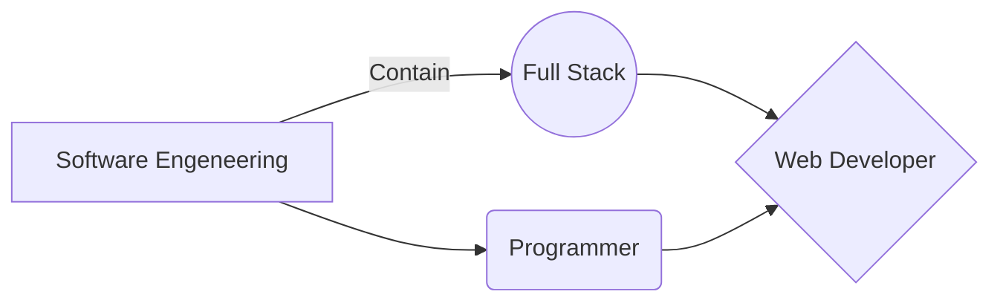

# 201 Course 


----
| number      | subject |
| ----------- | ----------- |
| 1      | Introduction HTML (pp.2-11)       |
| 2   | HTML Chapter 8: “Extra Markup” (p.176-199)        |
| 3   | HTML Chapter 17: “HTML5 Layout” (pp.428-451)        |
| 4   | HTML Chapter 18: “Process & Design” (pp.452-475)        |
| 5   | ntroduction to JavaScript|        |
| 6   | JS Chapter 1: “The ABC of Programming” (pp.11-52)        |
| 7   | HTML Chapter 1: “Structure” (pp.12-39)        |

----
### Introduction HTML (pp.2-11) 
1. how the web works ? 

>When you visit a website, the web server
hosting that site could be anywhere in the
world. In order for you to find the location of
the web server, your browser will first connect
to a Domain Name System (DNS) server.
* When you connect to the web,
you do so via an Internet Service
Provider (ISP). You type a
domain name or web address
into your browser to visit a site;
for example: google.com,
bbc.co.uk, microsoft.com.
* Your computer contacts a
network of servers called
Domain Name System (DNS)
servers. These act like phone
books; they tell your computer
the IP address associated with
the requested domain name.
An IP address is a number
of up to 12 digits separated
by periods / full stops. Every
device connected to the web
has a unique IP address; it is
like the phone number for that
computer.
* The unique number that the
DNS server returns to your
computer allows your browser
to contact the web server
that hosts the website you
requested. A web server is a
computer that is constantly
connected to the web, and is set
up especially to send web pages
to users.
* The web server then sends the
page you requested back to your
web browser.
----

### HTML Chapter 1: “Structure” (pp.12-39)
1. Tags and elements
```html
<html>
<body>
<h1>This is the Main Heading</h1>
<p>This text might be an introduction to the rest of
the page. And if the page is a long one it might
be split up into several sub-headings.<p>
<h2>This is a Sub-Heading</h2>
<p>Many long articles have sub-headings so to help
you follow the structure of what is being written.
There may even be sub-sub-headings (or lower-level
headings).</p>
<h2>Another Sub-Heading</h2>
<p>Here you can see another sub-heading.</p>
</body>
</html>
```
> **< html> tag:** *The opening <html> tag indicates that anything between it and a closing </html> tag is HTML code*

> **< body> tag:** *The <body> tag indicates that anything between it and the closing
>> </body> tag should be shown inside the main browser window.

> **< h1> tag:** Words between < h1> and < /h1> are a main heading. 

> **< p> tag:** A paragraph of text appears between these < p> and < /p> tags.

``` html
<p lang="en-us">Paragraph in English</p>
```
> The attribute name indicates
what kind of extra information
you are supplying about the
element's content. It should be
written in lowercase.
The value is the information
or setting for the attribute. It
should be placed in double
quotes. Different attributes can
have different values.
Here an attribute called lang is
used to indicate the language
used in this element. The value
of this attribute on this page
specifies it is in US English.

---

2. About HTML 

* HTML pages are text documents.
* HTML uses tags (characters that sit inside angled
brackets) to give the information they surround special
meaning.
* Tags are often referred to as elements.
* Tags usually come in pairs. The opening tag denotes
the start of a piece of content; the closing tag denotes
the end.
* Opening tags can carry attributes, which tell us more
about the content of that element.
* Attributes require a name and a value.
* To learn HTML you need to know what tags are
available for you to use, what they do, and where they
can go.
----
### HTML Chapter 8: “Extra Markup” (p.176-199)
1. Comments in HTML:

```html <!-- -->```
```html

<!-- start of introduction -->
<h1>Current Exhibitions</h1>
<h2>Olafur Eliasson</h2>
<!-- end of introduction -->
<!-- start of main text -->
<p>Olafur Eliasson was born in Copenhagen, Denmark
in 1967 to Icelandic parents.</p>
<p>He is known for sculptures and large-scale
installation art employing elemental materials
such as light, water, and air temperature to
enhance the viewer's experience.</p>
<!-- end of main text -->
<!--
<a href="mailto:info@example.org">Contact</a>
--> 
```
>If you want to add a comment
to your code that will not be
visible in the user's browser, you
can add the text between these
characters:
>> <!-- comment goes here -->
It is a good idea to add
comments to your code because,
no matter how familiar you
are with the page at the time
of writing it, when you come
back to it later (or if someone
else needs to look at the code),
comments will make it much
easier to understand.
Although comments are not
visible to users in the main
browser window, they can be
viewed by anyone who looks at
the source code behind the page.
On a long page you will often
see comments used to indicate
where sections of the page start
or end, and to pass on notes to
help anyone who is looking at
the code understand it.
Comments can also be used
around blocks of code to stop
that code from being displayed
in the browser. In the example on
the left, the email link has been
commented out.

2. ID Attribute: 
```html
<p>Water and air. So very commonplace are these
substances, they hardly attract attention - and
yet they vouchsafe our very existence.</p>
<p id="pullquote">Every time I view the sea I feel
a calming sense of security, as if visiting my
ancestral home; I embark on a voyage of seeing.
</p>
<p>Mystery of mysteries, water and air are right
there before us in the sea.</p>
```
>Every HTML element can carry
the id attribute. It is used to
uniquely identify that element
from other elements on the
page. Its value should start with
a letter or an underscore (not a
number or any other character).
It is important that no two
elements on the same page
have the same value for their id
attributes (otherwise the value is
no longer unique).
As you will see when you
come to look at CSS in the next
section, giving an element a
unique identity allows you to
style it differently than any other
instance of the same element
on the page. For example,
you might want to assign one
paragraph within the page
(perhaps a paragraph containing
a pull quote) a different style
than all of the other paragraphs.
In the example on the right, the
paragraph with the id attribute
whose value is pullquote is
made uppercase using CSS.
If you go on to learn about
JavaScript (a language that
allows you to add interactivity to
your pages), id attributes can be
used to allow the script to work
with that particular element.
The id attribute is known as a
global attribute because it can
be used on any element.
ID Attribute
Article
EXTRA MARKUP 184
Every HTML element can
also carry a class attribute.
Sometimes, rather than uniquely
identifying one element within
a document, you will want a
way to identify several elements
as being different from the
other elements on the page.
For example, you might have
some paragraphs of text that
contain information that is more
important than others and want
to distinguish these elements, or
you might want to differentiate
between links that point to other
pages on your own site and links
that point to external sites.
To do this you can use the
class attribute. Its value
should describe the class it
belongs to. In the example on
the left, key paragraphs have a
class attribute whose value is
important.
The class attribute on any
element can share the same
value. So, in this example, the
value of important could be
used on headings and links, too.
Result
>> <p class="important">For a one-year period from
November 2010, the Marugame Genichiro-Inokuma
Museum of Contemporary Art (MIMOCA) will host a
cycle of four Hiroshi Sugimoto exhibitions.</p>
<p>Each will showcase works by the artist
thematically contextualized under the headings
"Science," "Architecture," "History" and
"Religion" so as to present a comprehensive
panorama of the artist's oeuvre.</p>
<p class="important admittance">Hours: 10:00 – 18:00
(No admittance after 17:30)</p>
HTML chapter-08/class-attribute.html
Class

3- Class Attribute:
```html 
<p class="important">For a one-year period from
November 2010, the Marugame Genichiro-Inokuma
Museum of Contemporary Art (MIMOCA) will host a
cycle of four Hiroshi Sugimoto exhibitions.</p>
<p>Each will showcase works by the artist
thematically contextualized under the headings
"Science," "Architecture," "History" and
"Religion" so as to present a comprehensive
panorama of the artist's oeuvre.</p>
<p class="important admittance">Hours: 10:00 – 18:00
(No admittance after 17:30)</p>
```
>Every HTML element can
also carry a class attribute.
Sometimes, rather than uniquely
identifying one element within
a document, you will want a
way to identify several elements
as being different from the
other elements on the page.
For example, you might have
some paragraphs of text that
contain information that is more
important than others and want
to distinguish these elements, or
you might want to differentiate
between links that point to other
pages on your own site and links
that point to external sites.
To do this you can use the
class attribute. Its value
should describe the class it
belongs to. In the example on
the left, key paragraphs have a
class attribute whose value is
important.
The class attribute on any
element can share the same
value. So, in this example, the
value of important could be
used on headings and links, too.
>> By default, using these attributes
does not affect the presentation
of an element. It will only change
their appearance if there is a CSS
rule that indicates it should be
displayed differently.
In this example, CSS has been
applied to make elements with
a class attribute whose value
is important uppercase, and
elements with a class attribute
whose value is admittance red.
If you would like to indicate that
an element belongs to several
classes, you can separate class
names with a space, as you can
see in the third paragraph in the
example above

4- Block Elements:
```html 
<h1>Hiroshi Sugimoto</h1>
<p>The dates for the ORIGIN OF ART exhibition are as
follows:</p>
<ul>
<li>Science: 21 Nov - 20 Feb 2010/11</li>
<li>Architecture: 6 Mar - 15 May 2011</li>
<li>History: 29 May - 21 Aug 2011</li>
<li>Religion: 28 Aug - 6 Nov 2011</li>
</ul>
```
> Some elements will always
appear to start on a new line in
the browser window. These are
known as block level elements.
Examples of block elements are
>> < h1>, < p>, < ul>, and < li>.

5- Inline Elements:
``` html
Timed to a single revolution of the planet around
the sun at a 23.4 degrees tilt that plays out the
rhythm of the seasons, this <em>Origins of Art</em>
cycle is organized around four themes: <b>science,
architecture, history< /b> and <b>religion< /b>.
```
> Some elements will always
appear to continue on the
same line as their neighbouring
elements. These are known as
inline elements.
Examples of inline elements are

>> < a>, < b>, < em>, and < img>.

6-Grouping Te xt &
Elements In a Block
```html 
<div id="header">

<ul>
<li><a href="index.html">Home</a></li>
<li><a href="biography.html">Biography</a></li>
<li><a href="works.html">Works</a></li>
<li><a href="contact.html">Contact</a></li>
</ul>
</div><!-- end of header -->
```
>><div> block-elements.html HTML
The <div> element allows you to
group a set of elements together
in one block-level box.
For example, you might create
a <div> element to contain all
of the elements for the header
of your site (the logo and the
navigation), or you might create
a <div> element to contain
comments from visitors.
In a browser, the contents of
the <div> element will start on
a new line, but other than this
it will make no difference to the
presentation of the page.
Using an id or class attribute
on the <div> element, however,
means that you can create
CSS style rules to indicate how
much space the <div> element
should occupy on the screen and
change the appearance of all the
elements contained within it.
>>> It can also make it easier to
follow your code if you have used
<div> elements to hold each
section of the page.
Grouping Te xt &
Eleme nts In a Block
Since there may be several
other elements inside a <div>
element, it can be helpful to add
a comment after the closing
</div> tag.
This allows you to clearly see
which opening tag it is supposed
to correspond to, as shown at
the end of the example here.

-----

7-Grouping Text &
Elements Inline

```html
<p>Anish Kapoor won the Turner Prize in 1991 and
exhibited at the <span class="gallery">Tate
Modern</span> gallery in London in 2003.</p>
```
> The <span> element acts like
an inline equivalent of the <div>
element. It is used to either:
1. Contain a section of text
where there is no other suitable
element to differentiate it from
its surrounding text
2. Contain a number of inline
elements
The most common reason why
people use <span> elements
is so that they can control the
appearance of the content of
these elements using CSS.
You will usually see that a class
or id attribute is used with
<span> elements:
To explain the purpose of this
<span> element
So that CSS styles can be
applied to elements that
have specific values for these
attributes

8- IF rames

```html
<iframe
width="450"
height="350"
src="http://maps.google.co.uk/maps?q=moma+new+york
&amp;output=embed">
</iframe>
```
>An iframe is like a little window
that has been cut into your
page — and in that window you
can see another page. The term
iframe is an abbreviation of inline
frame.
One common use of iframes
(that you may have seen on
various websites) is to embed
a Google Map into a page. The
content of the iframe can be any
html page (either located on the
same server or anywhere else on
the web).
An iframe is created using the
>>< iframe> element. There are a
few attributes that you will need
to know to use it:

>>> src:
The src attribute specifies the
URL of the page to show in the
frame.
>>>> height:
The height attribute specifies
the height of the iframe in pixels.
>>>>> width:
The width attribute specifies
the width of the iframe in pixels

9- Information About
Your pages
```html 
<!DOCTYPE html>
<html>
<head>
<title>Information About Your Pages</title>
<meta name="description"
content="An Essay on Installation Art" />
<meta name="keywords"
content="installation, art, opinion" />
<meta name="robots"
content="nofollow" />
<meta http-equiv="author"
content="Jon Duckett" />
<meta http-equiv="pragma"
content="no-cache" />
<meta http-equiv="expires"
content="Fri, 04 Apr 2014 23:59:59 GMT" />
</head>
<body>
</body>
</html>
```
> The < meta> element also
uses the http-equiv and
content attributes in pairs.
In our example, you can see
three instances of the httpequiv
attribute. Each one has a
different purpose:
>> author
This defines the author of the
web page.
>>> pragma
This prevents the browser from
caching the page. (That is,
storing it locally to save time
downloading it on subsequent
visits.)
>>>> expires
Because browsers often cache
the content of a page, the
expires option can be used
to indicate when the page
should expire (and no longer be
cached). Note that the date must
be specified in the format shown.

10-Summary Extra Markup
>* DOCTYPES tell browsers which version of HTML you
are using.
* You can add comments to your code between the
<!-- and --> markers.
* The id and class attributes allow you to identify
particular elements.
* The <div> and <span> elements allow you to group
block-level and inline elements together.
* <iframes> cut windows into your web pages through
which other pages can be displayed.
* The <meta> tag allows you to supply all kinds of
information about your web page.
* Escape characters are used to include special
characters in your pages such as <, >, and ©.

---
### HTML Chapter 17: “HTML5 Layout” (pp.428-451)

* How old browsers understand new elements
>HTML5 introduces a new set of elements that allow you to divide up the
parts of a page. The names of these elements indicate the kind of content
you will find in them. They are still subject to change, but that has not
stopped many web page authors using them already.
>> **Headers & Footers:**
The <header> and <footer>
elements can be used for:
●● The main header or footer
that appears at the top or
bottom of every page on the
site.
●● A header or footer for an
individual <article> or
<section> within the page.
In this example, the <header>
element used to contain the site
name and the main navigation.
The <footer> element contains
copyright information, along
with links to the privacy policy
and terms and conditions.
Each individual <article> and
<section> element can also
have its own <header> and
<footer> elements to hold the
header or footer information for
that section within the page.
For example, on a page with
several blog posts, each
individual post can be thought
of as a separate section. The
<header> element can therefore
be used to contain the title and
date of each individual post, and
the <footer> might contain
links to share the article on
social networking sites.
Please note that all of the
code shown in this chapter
is referenced in one HTML
document which is called:
html5-layout.html
```html
<header>
<h1>Yoko's Kitchen</h1>
<nav>
<ul>
<li><a href="" class="current">home</a></li>
<li><a href="">classes</a></li>
<li><a href="">catering</a></li>
<li><a href="">about</a></li>
<li><a href="">contact</a></li>
</ul>
</nav>
</header>
<footer>
&copy; 2011 Yoko's Kitchen
</footer>
```
> **Navigation**
The <nav> element is used to
contain the major navigational
blocks on the site such as the
primary site navigation.
Going back to our blog example,
if you wanted to finish an article
with links to related blog posts,
these would not be counted as
major navigational blocks and
therefore should not sit inside a
>> <nav> element.
At the time of writing, some of
the developers that were already
using HTML5 decided to use the
<nav> element for the links that
appear at the bottom of every
page (links to things like privacy
policy, terms and conditions
and accessibility information).
Whether this will be widely
adopted is still yet to be seen.

```html
<nav>
<ul>
<li><a href="" class="current">home</a></li>
<li><a href="">classes</a></li>
<li><a href="">catering</a></li>
<li><a href="">about</a></li>
<li><a href="">contact</a></li>
</ul>
</nav>
```
>> Articles
The <article> element acts as
a container for any section of a
page that could stand alone and
potentially be syndicated.
This could be an individual
article or blog entry, a comment
or forum post, or any other
independent piece of content.
If a page contains several articles
(or even summaries of several
articles), then each individual
article would live inside its own
<article> element.
The <article> elements can
even be nested inside each
other. For example, a blog post
might live inside one <article>
element and each comment on
the article could live inside its
own child <article> element

```html
<article>
<figure>

<figcaption>Bok Choi</figcaption>
</figure>
<hgroup>
<h2>Japanese Vegetarian</h2>
<h3>Five week course in London</h3>
</hgroup>
<p>A five week introduction to traditional
Japanese vegetarian meals, teaching you a
selection of rice and noodle dishes.</p>
</article>
<article>
<figure>

<figcaption>Teriyaki Sauce</figcaption>
</figure>
<hgroup>
<h2>Sauces Masterclass</h2>
<h3>One day workshop</h3>
</hgroup>
<p>An intensive one-day course looking at how to
create the most delicious sauces for use in a
range of Japanese cookery.</p>
</article>
```
>> Article
The <aside> element has two
purposes, depending on whether
it is inside an <article>
element or not.
When the <aside> element
is used inside an <article>
element, it should contain
information that is related to the
article but not essential to its
overall meaning. For example, a
pullquote or glossary might be
considered as an aside to the
article it relates to.
When the <aside> element is
used outside of an <article>
element, it acts as a container
for content that is related to
the entire page. For example,
it might contain links to other
sections of the site, a list of
recent posts, a search box, or
recent tweets by the author.
```html
<aside>
<section class="popular-recipes">
<h2>Popular Recipes</h2>
<a href="">Yakitori (grilled chicken)</a>
<a href="">Tsukune (minced chicken patties)</a>
<a href="">Okonomiyaki (savory pancakes)</a>
<a href="">Mizutaki (chicken stew)</a>
</section>
<section class="contact-details">
<h2>Contact</h2>
<p>Yoko's Kitchen<br />
27 Redchurch Street<br />
Shoreditch<br />
London E2 7DP</p>
</section>
</aside>
```
>> Sections
The <section> element groups
related content together, and
typically each section would
have its own heading.
For example, on a homepage
there may be several <section>
elements to contain different
sections of the page, such as
latest news, top products, and
newsletter signup.
Because the <section> element
groups related items together,
it may contain several distinct
<article> elements that have a
common theme or purpose.
Alternatively, if you have a
page with a long article, the
<section> element can be
used to split the article up into
separate sections.
The <section> element should
not be used as a wrapper for
the entire page (unless the
page only contains one distinct
piece of content). If you want a
containing element for the entire
page, that job is still best left to
the <div> element.

```html
<section class="popular-recipes">
<h2>Popular Recipes</h2>
<a href="">Yakitori (grilled chicken)</a>
<a href="">Tsukune (minced chicken patties)</a>
<a href="">Okonomiyaki (savory pancakes)</a>
<a href="">Mizutaki (chicken stew)</a>
</section>
<section class="contact-details">
<h2>Contact</h2>
<p>Yoko's Kitchen<br />
27 Redchurch Street<br />
Shoreditch<br />
London E2 7DP</p>
</section>
```
>> Heading Groups:
The purpose of the <hgroup>
element is to group together a
set of one or more <h1> through
<h6> elements so that they are
treated as one single heading.
For example, the <hgroup>
element could be used to contain
both a title inside an <h2>
element and a subtitle within an
<h3> element.
This element has had a mixed
reception. When it was first
proposed by the people
developing HTML5, there were
some complaints and it was
withdrawn from the HTML5
proposals. However, some
people changed their minds and
it has been added it back into the
language. Some developers do
not like the use of the <hgroup>
element, and prefer to place a
subtitle inside a <p> element
(using an attribute to indicate
that it is a subheading).
Some suggest that it is of little
use other than as a styling hook.
It has, however, been popular
with those developers who
believe that it is useful to group
together the primary heading
and the subheading (as both can
be integral parts of a heading).

```html
<hgroup>
<h2>Japanese Vegetarian</h2>
<h3>Five week course in London</h3>
</hgroup>
```
>> Figures
You already met the <figure>
element in Chapter 5 when we
looked at images. It can be used
to contain any content that is
referenced from the main flow of
an article (not just images).
It is important to note that the
article should still make sense
if the content of the <figure>
element were moved (to another
part of the page, or even to a
different page altogether).
For this reason, it should only be
used when the content simply
references the element (and not
for something that is absolutely
integral to the flow of a page).
Examples of usage include:
* Images
* Videos
* Graphs
* Diagrams
* Code samples
* Text that supports the main
body of an article
>>> example layout html
```html
<p>A five week introduction to traditional Japanese vegetarian meals,
teaching you a selection of rice and noodle dishes.</p>
</article>
<article>
<figure>

<figcaption>Teriyaki Sauce</figcaption>
</figure>
<hgroup>
<h2>Sauces Masterclass</h2>
<h3>One day workshop</h3>
</hgroup>
<p>An intensive one-day course looking at how to create the most delicious
sauces for use in a range of Japanese cookery.</p>
</article>
</section>
<aside>
<section class="popular-recipes">
<h2>Popular Recipes</h2>
<a href="">Yakitori (grilled chicken)</a>
<a href="">Tsukune (minced chicken patties)</a>
<a href="">Okonomiyaki (savory pancakes)</a>
<a href="">Mizutaki (chicken stew)</a>
</section>
<section class="contact-details">
<h2>Contact</h2>
<p>Yoko's Kitchen<br />
27 Redchurch Street<br />
Shoreditch<br />
London E2 7DP</p>
</section>
</aside>
<footer>
&copy; 2011 Yoko's Kitchen
</footer>
</div><!-- .wrapper -->
</body>
</html>
```

* The new HTML5 elements i 
* ndicate the purpose of
different parts of a web page and help to describe
its structure.
* The new elements provide clearer code (compared
with using multiple <div> elements).
* Older browsers that do not understand HTML5
elements need to be told which elements are
block-level elements.
* To make HTML5 elements work in Internet Explorer 8
(and older versions of IE), extra JavaScript is needed,
which is available free from Google
----
#### HTML Chapter 18: “Process & Design” (pp.452-475)
* It's important to understand 
* ho your target audience
is, why they would come to your site, what information
they want to find and when they are likely to return.
* Site maps allow you to plan the structure of a site.
* Wireframes allow you to organize the information that
will need to go on each page.
* Design is about communication. Visual hierarchy helps
visitors understand what you are trying to tell them.
* You can differentiate between pieces of information
using size, color, and style.
* You can use grouping and similarity to help simplify
the information you present.
---
# JavaScript
* Introduction

**how js makes a web pages more intractive**

1- *ACCESS CONTENT*:

You can use JavaScript to select any
element, attribute, or text from an
HTML page. For example:
* Select the text inside all of the <hl>
elements on a page
* Select any elements that have a
c 1 ass attribute with a value of note
* Find out what was entered into a
text input whose id attribute has a
value of ema

2- *MODIFY CONTENT:*

You can use JavaScript to add
elements, attributes, and text to the
page, or remove them. For example:
* Add a paragraph of text after the
first <hl> element
* Change the value of c 1 ass
attributes to trigger new CSS rules
for those elements
* Change the size or position of an
<i mg> element

3- *PROGRAM RULES:*

You can specify a set of steps for
the browser to follow (like a recipe),
which allows it to access or change the
content of a page. For example:
* A gallery script could check which
image a user clicked on and display
a larger version of that image.
* A mortgage calculator could collect
values from a fo rm, perform a
ca lculation, and display repayments.
* An animation could check the
dimensions of the browser window
and move an image to the bottom
of the viewable area (also known as
the viewport).

4-*REACT TO EVENTS:*
You can specify that a script should run
when a specific event has occurred. For
example, it could be run when:
* A button is pressed
* A link is clicked (or tapped) on
* A cursor hovers over an element
* Information is added to a form
* An interval of time has passed
* A web page has finished loading
---

### JS Chapter 1: The ABC of Programming (pp.11-52)
HOW HTML, CSS,
& JAVASCRIPT FIT
TOGETHER ?
> Before diving into the JavaScript language, you
need to know how it will fit together with the
HTML and CSS in your web pages. 

HOW A BROWSER
SEES A WEB PAGE ?
>In order to understand how you can change the content of an HTML
page using JavaScript, you need to know how a browser interprets the
HTML code and applies styling to it.

WEB BROWSERS ARE
PROGRAMS BUILT
USING OBJECTS 
> You have seen how data can be used to create a model of a hotel or a car.
Web browsers create similar models of the web page they are showing
and of the browser window that the page is being shown in.
WINDOW OBJECT
On the right-hand page you can see a model of a
computer with a browser open on the screen.
The browser represents each window or tab using a
window object. The location property of the window
object will tell you the URL of the current page.
@ THE ABC OF PROGRAMMING
DOCUMENT OBJECT
The current web page loaded into each window is
modelled using a document object.
The title property of the document object tells you
what is between the opening <t; t le> and closing
>> </title> tag for that web page, and the
l astModi f i ed property of the document object
tells you the date this page was last updated.

-----
**Summary:**

* is best to keep JavaScript code in its own JavaScript
file. JavaScript files are text files (like HTML pages and
CSS style sheets), but they have the . j s extension.
* The HTML <script> element is used in HTML pages
to tell the browser to load the JavaScript file (rather like
the <link> element can be used to load a CSS file).
* If you view the source code of the page in the browser,
the JavaScript will not have changed the HTML,
because the script works with the model of the web
page that the browser has created.
* Computers approach tasks in a different way than
humans, so your instructions must let the computer
solve the task programmatically.
To approach writing a script, break down your goal into
a series of tasks and then work out each step needed
to complete that task (a flowchart can help).A script is a series of instructions that the computer
can follow in order to achieve a goal.
* Each time the script runs, it might only use a subset of
all the instructions.


----
- [x] useful
- [ ] not useful
---
@AnasAhmad
